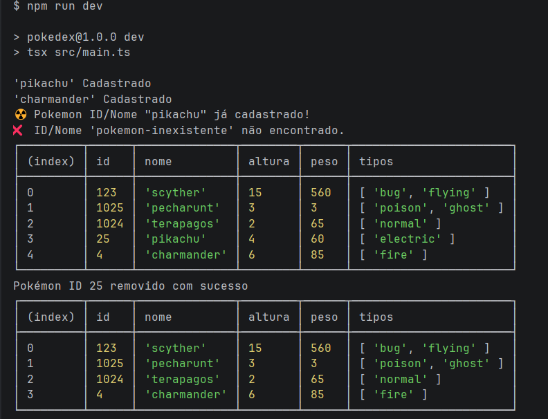
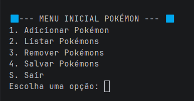
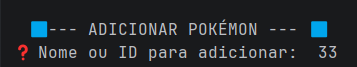
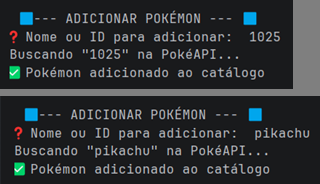
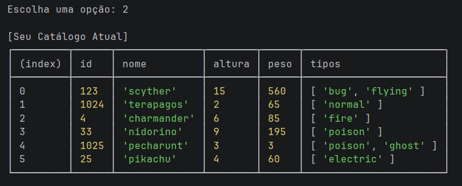
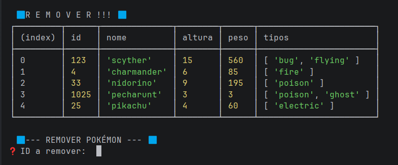
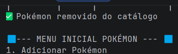
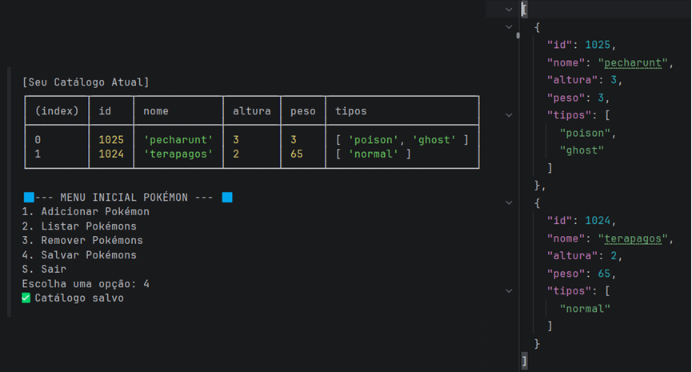

# Pokédex TypeScript Lite 

## Sobre o projeto

O Pokédex TypeScript Lite é uma aplicação simples em Node.js com TypeScript que consulta dados de Pokémon na PokeAPI e organiza alguns resultados em um catálogo local durante a execução do programa.

## Objetivo

Praticar os principais conceitos do Módulo 01:
- Node.js;
- JavaScript no back-end;
- TypeScript; 
- interfaces;
- funções tipadas; 
- arrays; 
- objetos; 
- JSON; 
- métodos de array; 
- classes; 
- async/await; 
- fetch; 
- tratamento de erros;
- GitHub; 
- GitFlow; 
- Kanban.

## Tecnologias utilizadas

- Node.js
- TypeScript 
- TSX 
- PokeAPI 
- Git
- GitHub

## Pré-requisitos

Antes de executar o projeto, é necessário ter instalado: 
- Node.js 
- npm 
- Git

## Como instalar

Clone o repositório:
```bash``` 
git clone https://github.com/rodrigomgrassioto/SCTEC_Mini-Projeto_Pokedex-TypeScript-Lite

Acesse a pasta do projeto:
cd SCTEC_Mini-Projeto_Pokedex-TypeScript-Lite

Instale as dependências:

npm install
Como executar
Execute o projeto em ambiente de desenvolvimento:

npm run dev

Estrutura do projeto:\
SCTEC_Mini-Projeto_Pokedex-TypeScript-Lite/\
│\
├── src/\
│   ├── main.ts\
│   ├── types.ts\
│   ├── pokeApi.ts\
│   └── catalogo.ts\
│\
├── package.json\
├── tsconfig.json\
└── README.md

Funcionalidades

- Buscar Pokémon por nome ou ID
- Tratar erro de Pokémon inexistente
- Transformar resposta da API em objeto simplificado
- Adicionar Pokémon ao catálogo local
- Impedir Pokémon duplicado
- Listar catálogo
- Remover Pokémon por ID
- Exibir mensagens no terminal
- Exemplos de execução
- Busca válida

Entrada testada:\
pikachu\
Saída obtida:\
[OK] Pokémon encontrado: pikachu
#25 - pikachu | Tipos: electric | Altura: 4 | Peso: 60\

Busca inválida\
Entrada testada:\
pokemon-inexistente\
Saída obtida:\
[ERRO] Pokémon não encontrado.

Duplicidade\
Entrada testada:\
adicionar pikachu duas vezes\
Saída obtida:\
[AVISO] pikachu já está no catálogo.

Remoção\
Entrada testada:\
remover ID 25\
Saída obtida:\
[OK] Pokémon removido do catálogo.

Conceitos aplicados

### TypeScript:  
O TypeScript foi integrado ao projeto para garantir segurança de tipos, facilitar a manutenção do código e evitar erros em tempo de execução.

### Interface PokemonResumo:
O objetivo desta interface é criar um modelo simplificado e leve para o armazenamento local de dados de um Pokémon.Em vez de salvar toda a resposta bruta da PokeAPI — que é muito grande e cheia de dados irrelevantes —, a interface PokemonResumo filtra e padroniza apenas os atributos essenciais necessários para o funcionamento interno do projeto (como id, name, types e sprite). Isso otimiza o uso da memória e reduz drasticamente o tamanho do arquivo JSON gerado.

### Fetch e async/await:
A aplicação consome os dados da PokeAPI de forma moderna e eficiente utilizando requisições assíncronas HTTP e o mecanismo de concorrência nativo do JavaScript/TypeScript:  
- #### fetch:
    Atua como o cliente HTTP que dispara as requisições para a URL da PokeAPI (ex: https://pokeapi.co...). Ele busca os dados de forma assíncrona para que a execução do terminal não congele enquanto espera a resposta da internet.
- #### async/await:
    É a sintaxe utilizada para gerenciar essa espera. O async avisa que a função realiza uma tarefa demorada em segundo plano, enquanto o await pausa a execução do código de forma limpa e linear, esperando a resposta da API chegar para só então salvar as informações na memória.

### Tratamento de erros:
O projeto utiliza um bloco try/catch para capturar falhas de rede e validar as respostas da API, impedindo que o aplicativo trave caso o usuário digite um nome ou ID inválido.  
- #### Validação:
    ##### !resposta.ok:
  - Captura o erro 404 quando o Pokémon digitado não existe no banco de dados da API, retornando null de forma segura.
- ##### Bloco catch:
  -  Protege a aplicação contra quedas inesperadas de internet ou servidores fora do ar, exibindo uma mensagem limpa no terminal em vez de estourar um erro crítico no Node.js.

### Métodos de array:
Os métodos nativos de manipulação de arrays do JavaScript/TypeScript foram fundamentais para processar, buscar e validar os dados dentro do catálogo, atendendo aos requisitos funcionais (RF11). Foram utilizados três métodos principais:  
1. map(): Utilizado para transformar e extrair dados específicos de uma lista de objetos.  
   - Onde foi usado: Na formatação dos dados brutos recebidos da API (dadosBrutos.types.map).
   - Como funciona: O método percorre todo o array de tipos da PokeAPI e extrai apenas a propriedade de texto (name), convertendo uma estrutura de objetos complexa em um array simples de strings (ex: ['grass', 'poison']).
2. find(): Utilizado para realizar buscas refinadas dentro do catálogo de Pokémons.
   - Onde foi usado: No fluxo de remoção de dados, para localizar um Pokémon específico através do seu identificador exclusivo (this.catalogo.find(p => p.id === id)).
   - Como funciona: Ele percorre o catálogo e retorna o primeiro objeto que possui o id exatamente igual ao informado. Se encontrar, o objeto é retornado; caso contrário, retorna undefined, permitindo validar que o ID não existe.
3. some(): Utilizado como uma regra de validação rápida para checar a existência de elementos.  
   - Onde foi usado: Na etapa de inserção de novos Pokémons, para impedir a duplicação de dados salvos na memória (this.catalogo.some(p => p.id == pokemon.id)).
   - Como funciona: O método testa se pelo menos um Pokémon do catálogo já possui o mesmo id. Ele retorna um valor booleano (true ou false), servindo de gatilho para disparar o aviso de que o Pokémon já foi cadastrado.

### Classe CatalogoPokemon (implementada como BoxService)
Esta classe atua como o motor de gerenciamento do sistema, controlando a lista de Pokémons na memória, aplicando regras de negócio e realizando a persistência de dados no arquivo local.
#### Atributos:
- catalogo (PokemonResumo[]): Array privado que armazena os Pokémons cadastrados na memória RAM durante a execução do programa.
- caminhoArquivo (string): Constante privada que define o local onde o arquivo JSON de salvamento é lido e gravado (./pc_box.json).
- apiService (PokeApiService): Instância injetada via construtor para permitir a comunicação direta com o serviço de buscas da API.

#### Métodos:
- obterCatalogo(): Retorna a lista atual de Pokémons armazenados na memória para exibição em outras partes do sistema.
- buscarPokemonNaApiAddCatalogo(termo): Método assíncrono que busca o Pokémon na API através do termo digitado. Ele valida se o retorno é nulo e aplica a regra de negócio que impede cadastros duplicados usando o método some().
- removerPorId(id): Localiza a referência de um Pokémon no catálogo usando o método find(). Caso encontre, descobre sua posição na lista através do indexOf() e o remove da memória usando splice().
- salvarJson(): Transforma o array catalogo atualizado em texto formatado e o grava fisicamente no disco utilizando o módulo de arquivos do Node.js.
- carregarJson(): Disparado automaticamente no construtor da classe. Lê o arquivo de salvamento local, limpa espaços em branco e reconverte o texto para objetos na memória, tratando cenários de arquivos vazios ou inexistentes de forma segura.


## Organização do Kanban:

Link do Kanban:
https://trello.com/invite/b/6a24a00a928e2dd58784cbe3/ATTIe58d35b008905a10e78d4df0900d99b73175E4CC/sctec-mini-projeto-pokedex

### Branches utilizadas:

- main
- develop
- feat/pokedex
- docs/readme

### Melhorias futuras

- Criar menu interativo no terminal ✅ Feito
- Salvar catálogo em arquivo JSON ✅ Feito
- Exibir HP, ataque e defesa
- Criar filtros por tipo de Pokémon
- Criar uma API própria com Express


## Exemplos de execução

### 1 - Ao rodar main.ts:


### 2 - Menu inicial:


### 3 - Sub-menu adicionar Pokémon:


### 4 - Adicionando por id e nome:


### 5 - Listar catálogo:


### 6 - Sub-menu remover:


### 8 - Resultado da remoção:


### 9 - Salvando e resultado no arquivo Json:

